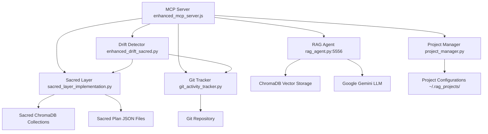

# ContextKeeper MCP Tools - Complete Reference Guide

**Version**: 3.0.0 Sacred Layer  
**Date**: 2025-07-24  
**MCP Server**: `/mcp-server/enhanced_mcp_server.js`

This document provides comprehensive documentation for all 8 MCP tools available in the ContextKeeper Sacred Layer integration, including their capabilities, usage examples, internal component connections, and practical applications.

---

## 🎯 Overview

The ContextKeeper MCP server provides 8 sacred-aware tools that integrate directly with Claude Code and other AI assistants. These tools bridge the gap between AI agents and your development context, ensuring AI compliance with architectural constraints while providing rich contextual information.

### Tool Categories

1. **Sacred Layer Tools** (Core Protection)
   - `get_sacred_context` - Retrieve architectural plans
   - `check_sacred_drift` - Monitor plan compliance
   - `create_sacred_plan` - Create new architectural constraints

2. **Enhanced Context Tools** (Rich Information)
   - `query_with_llm` - Natural language responses
   - `intelligent_search` - Semantic search across all content
   - `get_development_context` - Comprehensive project status

3. **Integration Tools** (AI Assistant Support)
   - `export_development_context` - Complete context export
   - `health_check` - System status monitoring

---

## 🔧 Tool Detailed Documentation

## 1. get_sacred_context

### Purpose
Retrieves sacred architectural plans and constraints for a project, providing AI agents with immutable guidelines that must be respected during development.

### Internal Components
- **Primary**: `sacred_layer_implementation.py` → `SacredLayerManager.get_plans()`
- **Storage**: ChromaDB collection `sacred_{project_id}`
- **API Endpoint**: `GET /sacred/plans`

### Parameters
```json
{
  "project_id": "string (optional)",
  "plan_status": "approved|draft|all (default: approved)"
}
```

### Usage Examples

#### Basic Usage (Get approved plans for current project)
```json
{
  "tool": "get_sacred_context",
  "arguments": {
    "project_id": "myproject_123"
  }
}
```

#### Get All Plans (Including Drafts)
```json
{
  "tool": "get_sacred_context", 
  "arguments": {
    "project_id": "myproject_123",
    "plan_status": "all"
  }
}
```

### Response Format
```markdown
# Sacred Architectural Context

## Project: myproject_123

## Sacred Plans (2 approved)

### Authentication Architecture
**Status**: approved
**Created**: 2h ago
**Approved**: 1h ago

Use JWT tokens with 24-hour expiry...

---

### Database Schema Design
**Status**: approved
**Created**: 1d ago
**Approved**: 20h ago

Primary tables: users, sessions, projects...

## Sacred Layer Status
- **Immutability**: Approved plans cannot be modified
- **2-Layer Verification**: Required for plan approval
- **AI Compliance**: AI agents must respect sacred constraints
```

### When to Use
- **Before starting new features** - Understand architectural constraints
- **During code reviews** - Verify compliance with approved plans
- **When onboarding team members** - Share architectural decisions
- **AI-assisted development** - Ensure AI tools follow guidelines

### Caching
- **Cached**: Yes (5 minutes)
- **Cache Key**: `get_sacred_context-{project_id}-{plan_status}`

---

## 2. check_sacred_drift

### Purpose
Analyzes recent development activity against sacred plans to detect violations of architectural constraints, providing real-time compliance monitoring.

### Internal Components
- **Primary**: `enhanced_drift_sacred.py` → `SacredDriftDetector.analyze_drift()`
- **Git Tracking**: `git_activity_tracker.py` → `GitActivityTracker.get_recent_activity()`
- **API Endpoint**: `GET /sacred/drift/{project_id}`

### Parameters
```json
{
  "project_id": "string (required)",
  "hours": "number (default: 24)"
}
```

### Usage Examples

#### Daily Drift Check
```json
{
  "tool": "check_sacred_drift",
  "arguments": {
    "project_id": "myproject_123",
    "hours": 24
  }
}
```

#### Quick Recent Check (Last 4 hours)
```json
{
  "tool": "check_sacred_drift",
  "arguments": {
    "project_id": "myproject_123", 
    "hours": 4
  }
}
```

### Response Format
```markdown
# Sacred Drift Analysis

## Project: myproject_123
## Analysis Period: Last 24 hours

### Alignment Status: ALIGNED
### Alignment Score: 95.2%

## ✅ No Sacred Plan Violations Detected

## Recommendations
- Continue current authentication implementation approach
- Consider adding unit tests for new JWT validation logic

## Sacred Plans Consulted
- plan_auth_architecture_abc123
- plan_database_schema_def456

## Development Status
✅ **ALIGNED**

Your development is aligned with sacred architectural plans. Continue current approach.
```

### Status Levels
- **✅ aligned** (90-100%): Perfect compliance
- **⚠️ minor_drift** (70-89%): Small deviations, easily correctable
- **🔶 moderate_drift** (50-69%): Significant issues requiring attention
- **🚨 critical_violation** (0-49%): Major architectural violations

### When to Use
- **Daily standup prep** - Check team alignment
- **Before merging PRs** - Ensure compliance
- **After major changes** - Verify architectural integrity
- **CI/CD integration** - Automated compliance checking

### Caching
- **Cached**: Yes (5 minutes)
- **Cache Key**: `check_sacred_drift-{project_id}-{hours}`

---

## 3. query_with_llm

### Purpose
Queries the knowledge base using natural language and returns conversational responses powered by Gemini, transforming raw code chunks into readable explanations.

### Internal Components
- **Primary**: `rag_agent.py` → `ProjectKnowledgeAgent.query_with_llm()`
- **Vector Search**: ChromaDB → `gemini-embedding-001` → Google Gemini
- **LLM Processing**: Google Gemini 2.0 Flash (via Vertex AI)
- **API Endpoint**: `POST /query_llm`

### Parameters
```json
{
  "question": "string (required)",
  "k": "number (default: 5)"
}
```

### Usage Examples

#### Architecture Questions
```json
{
  "tool": "query_with_llm",
  "arguments": {
    "question": "How does the authentication system work?",
    "k": 5
  }
}
```

#### Implementation Details
```json
{
  "tool": "query_with_llm",
  "arguments": {
    "question": "What's the difference between our user roles system and permissions?",
    "k": 3
  }
}
```

### Response Format
```markdown
# Knowledge Base Query

**Question**: How does the authentication system work?

## Answer

The authentication system uses a JWT-based approach with the following components:

1. **Token Generation**: When users log in, the system generates a JWT token containing user ID, roles, and expiration time (24 hours).

2. **Middleware Validation**: Each API request passes through authentication middleware that verifies the JWT token signature and checks expiration.

3. **Role-Based Access**: The system includes three user roles (admin, user, guest) with different permission levels enforced at both API and UI levels.

The implementation prioritises security with automatic token refresh and secure storage practices.

## Sources

- /Users/username/project/auth/jwt_manager.py
- /Users/username/project/middleware/auth_middleware.py
- /Users/username/project/models/user.py

*Used 5 context chunks*
```

### Performance
- **Response Time**: ~2.7 seconds average
- **Context Window**: Uses top 5 most relevant chunks by default
- **Token Efficiency**: Focuses on most relevant information to minimise LLM tokens

### When to Use
- **Understanding existing code** - Get explanations instead of raw chunks
- **Architecture exploration** - Learn system design decisions
- **Debugging assistance** - Understand how components interact
- **Documentation generation** - Create readable explanations from code

### Caching
- **Cached**: No (responses may vary based on LLM generation)

---

## 4. export_development_context

### Purpose
Exports comprehensive development context including project information, sacred plans, and drift analysis in a format optimised for AI assistant consumption.

### Internal Components
- **Primary**: `project_manager.py` → `ProjectManager.export_context()`
- **Sacred Integration**: Uses `get_sacred_context()` and `check_sacred_drift()`
- **API Endpoint**: `GET /context/export`

### Parameters
```json
{
  "project_id": "string (optional)",
  "include_sacred": "boolean (default: true)",
  "include_drift": "boolean (default: true)"
}
```

### Usage Examples

#### Full Context Export
```json
{
  "tool": "export_development_context",
  "arguments": {
    "project_id": "myproject_123",
    "include_sacred": true,
    "include_drift": true
  }
}
```

#### Basic Context Only
```json
{
  "tool": "export_development_context",
  "arguments": {
    "project_id": "myproject_123",
    "include_sacred": false,
    "include_drift": false
  }
}
```

### Response Format
```markdown
# Development Context Export

**Generated**: 2025-07-24T20:30:00.000Z
**Project**: myproject_123

## Project Information

{
  "project": {
    "name": "My Project",
    "status": "active",
    "root_path": "/Users/username/myproject",
    "created_at": "2025-07-01T10:00:00.000Z"
  },
  "decisions": [
    {
      "title": "Use JWT for authentication",
      "reasoning": "Better security and stateless design",
      "date": "2025-07-15"
    }
  ],
  "objectives": [
    {
      "title": "Implement user management",
      "status": "in_progress",
      "priority": "high"
    }
  ]
}

---

# Sacred Architectural Context
[Full sacred plans content]

---

# Sacred Drift Analysis
[Full drift analysis]

---

## Context Export Notes
- Sacred plans provide architectural constraints for AI agents
- Drift analysis indicates alignment with approved plans
- This context enables sacred-aware AI development
```

### When to Use
- **AI assistant setup** - Provide comprehensive project context
- **Team onboarding** - Share complete project understanding
- **Code review preparation** - Include all relevant context
- **Documentation generation** - Create comprehensive project overviews

### Caching
- **Cached**: Yes (5 minutes)
- **Cache Key**: `export_development_context-{project_id}-{include_sacred}-{include_drift}`

---

## 5. get_development_context

### Purpose
Provides comprehensive development context including project status, git activity, objectives, decisions, and sacred layer analysis for AI-assisted development.

### Internal Components
- **Primary**: `project_manager.py` → `ProjectManager.get_project_summary()`
- **Git Integration**: `git_activity_tracker.py` → `GitActivityTracker.analyze_recent_activity()`
- **Sacred Integration**: Uses `get_sacred_context()`
- **API Endpoint**: `GET /context/export`

### Parameters
```json
{
  "project_id": "string (optional)",
  "include_git": "boolean (default: true)",
  "include_sacred": "boolean (default: true)",
  "hours": "number (default: 24)"
}
```

### Usage Examples

#### Full Development Context
```json
{
  "tool": "get_development_context",
  "arguments": {
    "project_id": "myproject_123",
    "include_git": true,
    "include_sacred": true,
    "hours": 48
  }
}
```

#### Context Without Git Activity
```json
{
  "tool": "get_development_context",
  "arguments": {
    "project_id": "myproject_123",
    "include_git": false,
    "hours": 24
  }
}
```

### Response Format
```markdown
# Comprehensive Development Context

## Project: My Project
**Status**: active
**Path**: /Users/username/myproject

---

# Sacred Architectural Context

## Project: myproject_123

## Sacred Plans (2 approved)
[Sacred plans content...]

## Sacred Layer Status
- **Immutability**: Approved plans cannot be modified
- **2-Layer Verification**: Required for plan approval
- **AI Compliance**: AI agents must respect sacred constraints
```

### When to Use
- **Start of development sessions** - Understand current project state
- **Code review preparation** - Get complete context including sacred constraints
- **AI pair programming** - Provide AI assistant with full project understanding
- **Status reporting** - Generate comprehensive project summaries

### Caching
- **Cached**: Yes (5 minutes)
- **Cache Key**: `get_development_context-{project_id}-{include_git}-{include_sacred}-{hours}`

---

## 6. intelligent_search

### Purpose
Performs semantic search across code, decisions, objectives, and sacred plans using natural language queries, powered by LLM enhancement for contextual understanding.

### Internal Components
- **Primary**: `rag_agent.py` → `ProjectKnowledgeAgent.query_with_llm()`
- **Search Engine**: ChromaDB with `gemini-embedding-001` embeddings
- **Content Types**: Code files, decisions, objectives, sacred plans
- **API Endpoint**: `POST /query_llm` (leverages LLM enhancement)

### Parameters
```json
{
  "query": "string (required)",
  "search_types": "array (default: ['all'])",
  "project_id": "string (optional)",
  "max_results": "number (default: 5)"
}
```

#### Search Types
- **`code`**: Source code files, comments, documentation
- **`decisions`**: Architectural decisions and reasoning
- **`objectives`**: Development goals and milestones
- **`sacred_plans`**: Sacred architectural plans
- **`all`**: Search across all content types

### Usage Examples

#### Cross-Content Search
```json
{
  "tool": "intelligent_search",
  "arguments": {
    "query": "authentication implementation approach",
    "search_types": ["all"],
    "max_results": 5
  }
}
```

#### Sacred Plans Only
```json
{
  "tool": "intelligent_search",
  "arguments": {
    "query": "database schema constraints",
    "search_types": ["sacred_plans"],
    "project_id": "myproject_123",
    "max_results": 3
  }
}
```

#### Code-Specific Search
```json
{
  "tool": "intelligent_search",
  "arguments": {
    "query": "JWT token validation logic",
    "search_types": ["code"],
    "max_results": 10
  }
}
```

### Response Format
```markdown
# Intelligent Search Results

**Query**: authentication implementation approach

## Answer

The authentication implementation uses a multi-layered approach combining JWT tokens for stateless authentication with role-based access control (RBAC). Here's the breakdown:

**1. JWT Token Management:**
- Tokens generated with 24-hour expiry
- Includes user ID, roles, and permissions
- Automatic refresh mechanism for active sessions

**2. Middleware Integration:**
- Authentication middleware validates tokens on each request
- Extracts user context and injects into request objects
- Handles both API and web interface authentication

**3. Role-Based Permissions:**
- Three primary roles: admin, user, guest
- Permission matrix controls feature access
- Database-driven role assignments for flexibility

The approach prioritises security while maintaining good user experience through automatic token management.

## Sources Found

- /Users/username/project/auth/jwt_manager.py
- /Users/username/project/middleware/auth_middleware.py
- /Users/username/project/models/user.py
- /Users/username/project/sacred_plans/auth_architecture.md
```

### When to Use
- **Research existing implementations** - Find related code across the project
- **Understand design decisions** - Search decisions and sacred plans together
- **Explore feature relationships** - See how different components connect
- **Find examples** - Locate similar implementations for reference

### Performance
- **Response Time**: ~2-3 seconds
- **Search Accuracy**: Semantic matching across all content types
- **Result Relevance**: Ranked by vector similarity and LLM processing

### Caching
- **Cached**: No (search results may vary and need real-time accuracy)

---

## 7. create_sacred_plan

### Purpose
Creates new sacred architectural plans that serve as immutable constraints for AI-assisted development, requiring 2-layer verification before becoming active.

### Internal Components
- **Primary**: `sacred_layer_implementation.py` → `SacredLayerManager.create_plan()`
- **Storage**: ChromaDB collection `sacred_{project_id}` + JSON file storage
- **Verification**: Hash-based verification codes + environment key
- **API Endpoint**: `POST /sacred/plans`

### Parameters
```json
{
  "project_id": "string (required)",
  "title": "string (required)",
  "content": "string (required, markdown format)"
}
```

### Usage Examples

#### Create Authentication Plan
```json
{
  "tool": "create_sacred_plan",
  "arguments": {
    "project_id": "myproject_123",
    "title": "Authentication Architecture v2.0",
    "content": "# Authentication Architecture\n\n## Core Principles\n\n1. **Stateless Design**: Use JWT tokens for all authentication\n2. **Role-Based Access**: Implement 3-tier permission system\n3. **Security First**: 24-hour token expiry with refresh mechanism\n\n## Implementation Requirements\n\n- JWT tokens must include: user_id, roles, permissions, exp\n- All API endpoints require authentication middleware\n- Token refresh must be automatic and transparent\n\n## Constraints\n\n- NO session storage in database\n- NO plain text passwords in logs\n- ALL auth failures must be logged with user context"
  }
}
```

#### Create Database Schema Plan
```json
{
  "tool": "create_sacred_plan",
  "arguments": {
    "project_id": "myproject_123",
    "title": "Database Schema Design",
    "content": "# Database Schema Sacred Plan\n\n## Core Tables\n\n### users\n- id (UUID, primary key)\n- email (unique, not null)\n- password_hash (bcrypt, not null)\n- role_id (foreign key to roles)\n- created_at, updated_at\n\n### sessions\n- id (UUID, primary key)\n- user_id (foreign key to users)\n- token_hash (unique)\n- expires_at (timestamp)\n\n## Constraints\n\n- All IDs must be UUIDs\n- All timestamps in UTC\n- Foreign key constraints required\n- NO cascading deletes on user data"
  }
}
```

### Response Format
```markdown
# Sacred Plan Created

**Plan ID**: plan_abc123def456
**Title**: Authentication Architecture v2.0
**Project**: myproject_123
**Status**: draft

## Next Steps

To approve this sacred plan, use the 2-layer verification:
1. **Verification Code**: `auth-arch-20250724-1630-abc123`
2. **Approval Key**: Set in environment as SACRED_APPROVAL_KEY

**Note**: Plans must be approved before they become active architectural constraints.
```

### Approval Process
1. **Create Plan**: Plan is created in `draft` status
2. **Generate Verification Code**: Unique hash-based code generated
3. **2-Layer Verification Required**:
   - Verification code (proves plan creation intent)
   - Environment key `SACRED_APPROVAL_KEY` (proves authorized approver)
4. **Plan Activated**: Status changes to `approved`, becomes immutable

### When to Use
- **Starting new projects** - Define core architectural principles
- **Major refactoring** - Document new structural decisions
- **Team alignment** - Create shared architectural understanding
- **AI constraint setting** - Define boundaries for AI-assisted development

### Security Features
- **Immutability**: Approved plans cannot be modified
- **Audit Trail**: All plan operations logged with timestamps
- **2-Layer Verification**: Prevents accidental or unauthorized approvals
- **Content Versioning**: New versions require separate plans

### Caching
- **Cached**: No (plan creation is a write operation)

---

## 8. health_check

### Purpose
Monitors the health and status of all ContextKeeper components including the RAG agent, Sacred Layer, LLM enhancement, and MCP server itself.

### Internal Components
- **RAG Agent**: `rag_agent.py` → `GET /health`
- **Sacred Layer**: `sacred_layer_implementation.py` → `GET /sacred/health`
- **LLM Enhancement**: `rag_agent.py` → `POST /query_llm` (test query)
- **MCP Server**: Internal status and cache monitoring

### Parameters
```json
{}
```
*No parameters required*

### Usage Examples

#### Basic Health Check
```json
{
  "tool": "health_check",
  "arguments": {}
}
```

### Response Format
```markdown
# ContextKeeper Sacred Layer Health Check

## RAG Agent: ✅ Running
**URL**: http://localhost:5556

## Sacred Layer: ✅ Active
**Status**: Ready

## LLM Enhancement: ✅ Active
**Response Time**: Fast

## MCP Server Status
**Version**: 3.0.0 (Sacred Layer)
**Tools Available**: 8
**Cache Size**: 12 entries
```

### Component Status Indicators

#### RAG Agent Status
- **✅ Running**: Agent responding to requests
- **❌ Error**: Connection failed or timeout

#### Sacred Layer Status
- **✅ Active**: Sacred layer endpoints responding
- **❌ Error**: Sacred layer not initialized or failing

#### LLM Enhancement Status
- **✅ Active**: LLM queries working normally
- **❌ Error**: Gemini API issues or endpoint problems

### Health Check Endpoints Used
- `GET /health` - Basic RAG agent status
- `GET /sacred/health` - Sacred layer specific status
- `POST /query_llm` - Test LLM enhancement with minimal query

### When to Use
- **System monitoring** - Regular health status verification
- **Troubleshooting** - Identify which components are failing
- **Setup verification** - Confirm all systems working after installation
- **Performance monitoring** - Track cache usage and response times

### Diagnostic Information
- **Version**: MCP server version for compatibility
- **Tools Available**: Confirms all 8 tools are loaded
- **Cache Size**: Indicates caching performance
- **Response Times**: Basic performance indicators

### Caching
- **Cached**: No (health status needs real-time accuracy)

---

## 🔗 Component Architecture Map

### Internal Component Connections



### Data Flow by Tool

#### 1. get_sacred_context
```
MCP → RAG Agent → Sacred Layer → ChromaDB sacred_{project_id} → JSON Files
```

#### 2. check_sacred_drift  
```
MCP → RAG Agent → Drift Detector → Git Tracker → Sacred Layer → Analysis
```

#### 3. query_with_llm
```
MCP → RAG Agent → ChromaDB → Google Gemini → Natural Language Response
```

#### 4. export_development_context
```
MCP → Project Manager → get_sacred_context → check_sacred_drift → Combined Export
```

#### 5. get_development_context
```
MCP → Project Manager → Git Tracker → Sacred Layer → Comprehensive Status
```

#### 6. intelligent_search
```
MCP → RAG Agent → ChromaDB Semantic Search → Google Gemini → Enhanced Results
```

#### 7. create_sacred_plan
```
MCP → Sacred Layer → ChromaDB sacred_{project_id} → JSON Storage → Verification Code
```

#### 8. health_check
```
MCP → [All Components] → Status Aggregation → Health Report
```

---

## 🚀 Integration Best Practices

### 1. Claude Code Integration Patterns

#### Morning Context Gathering
```javascript
// Example: Start-of-day AI assistant briefing
async function morningBriefing(projectId) {
  const health = await mcp.health_check();
  const context = await mcp.get_development_context({ 
    project_id: projectId,
    hours: 48 // Weekend + today
  });
  const drift = await mcp.check_sacred_drift({
    project_id: projectId,
    hours: 24
  });
  
  return { health, context, drift };
}
```

#### Pre-Development Sacred Check
```javascript
// Example: Before starting new feature
async function preFeatureCheck(projectId, featureDescription) {
  const sacredPlans = await mcp.get_sacred_context({
    project_id: projectId,
    plan_status: 'approved'
  });
  
  const searchResults = await mcp.intelligent_search({
    query: featureDescription,
    search_types: ['sacred_plans', 'decisions'],
    max_results: 5
  });
  
  return { sacredPlans, searchResults };
}
```

### 2. Error Handling Patterns

#### Graceful Degradation
```javascript
async function safeToolCall(toolName, args) {
  try {
    return await mcp[toolName](args);
  } catch (error) {
    console.warn(`MCP tool ${toolName} failed:`, error.message);
    
    // Fallback strategies
    if (toolName === 'query_with_llm') {
      // Fall back to basic search
      return await mcp.intelligent_search({
        query: args.question,
        max_results: args.k || 5
      });
    }
    
    return { error: error.message, tool: toolName };
  }
}
```

### 3. Performance Optimization

#### Batch Operations
```javascript
// Example: Efficient context gathering
async function getBatchContext(projectId) {
  const [sacred, drift, health] = await Promise.all([
    mcp.get_sacred_context({ project_id: projectId }),
    mcp.check_sacred_drift({ project_id: projectId }),
    mcp.health_check()
  ]);
  
  return { sacred, drift, health };
}
```

#### Cache-Aware Usage
```javascript
// Example: Respect caching for expensive operations
const CACHE_SENSITIVE_TOOLS = [
  'get_sacred_context',
  'check_sacred_drift', 
  'export_development_context',
  'get_development_context'
];

async function cachedToolCall(toolName, args) {
  if (CACHE_SENSITIVE_TOOLS.includes(toolName)) {
    // These tools are cached for 5 minutes
    // Avoid rapid successive calls
    console.log(`Using cached ${toolName} (5min cache)`);
  }
  
  return await mcp[toolName](args);
}
```

### 4. Sacred Plan Workflow

#### Complete Sacred Plan Creation
```javascript
async function createAndApproveSacredPlan(projectId, title, content) {
  // Step 1: Create plan
  const creation = await mcp.create_sacred_plan({
    project_id: projectId,
    title: title,
    content: content
  });
  
  console.log('Plan created:', creation.content[0].text);
  console.log('Next: Use verification code to approve the plan');
  
  // Step 2: Approval happens outside MCP (requires manual 2-layer verification)
  // User must use CLI: ./scripts/rag_cli.sh sacred approve {plan_id} --verification-code {code}
  
  return creation;
}
```

---

## 🔧 Troubleshooting Guide

### Common Issues and Solutions

#### 1. MCP Server Connection Failed
**Symptoms**: `contextkeeper-sacred` shows ✗ Failed to connect in `claude mcp list`

**Solutions**:
1. **Check RAG Agent**: Ensure running on port 5556
   ```bash
   curl http://localhost:5556/health
   ```

2. **Check Environment**: Verify `RAG_AGENT_URL` in MCP config
   ```json
   "env": {
     "RAG_AGENT_URL": "http://localhost:5556"
   }
   ```

3. **Restart Services**:
   ```bash
   # Terminal 1: Start RAG Agent
   cd contextkeeper
   source venv/bin/activate
   python rag_agent.py start
   
   # Terminal 2: Test MCP
   claude mcp list
   ```

#### 2. Sacred Layer Not Active
**Symptoms**: `health_check` shows "Sacred Layer: ❌ Error"

**Solutions**:
1. **Check Sacred Layer Initialization**:
   ```bash
   curl http://localhost:5556/sacred/health
   ```

2. **Verify Environment Variable**:
   ```bash
   echo $SACRED_APPROVAL_KEY
   ```

3. **Check Logs**:
   ```bash
   tail -f rag_agent.log
   ```

#### 3. LLM Enhancement Failing
**Symptoms**: `query_with_llm` returns errors or timeouts

**Solutions**:
1. **Check Google Cloud Credentials**:
   ```bash
   echo $GOOGLE_APPLICATION_CREDENTIALS
   gcloud auth application-default print-access-token
   ```

2. **Test Gemini API**:
   ```bash
   curl -X POST http://localhost:5556/query_llm \
     -H "Content-Type: application/json" \
     -d '{"question": "test", "k": 1}'
   ```

3. **Check Vertex AI API Enabled**:
   - Visit Google Cloud Console
   - Enable Vertex AI API
   - Verify project quotas

#### 4. ChromaDB Issues
**Symptoms**: Search tools return empty results or errors

**Solutions**:
1. **Check Database**:
   ```bash
   ls -la rag_knowledge_db/
   ls -la rag_knowledge_db/sacred_chromadb/
   ```

2. **Rebuild Index** (if corrupted):
   ```bash
   # Backup and rebuild
   mv rag_knowledge_db rag_knowledge_db.backup
   python rag_agent.py ingest /path/to/project
   ```

#### 5. Permission Errors
**Symptoms**: File access or creation failures

**Solutions**:
1. **Check Permissions**:
   ```bash
   ls -la ~/.rag_projects/
   chmod -R 755 ~/.rag_projects/
   ```

2. **Storage Paths**:
   ```bash
   mkdir -p ~/.rag_projects/
   mkdir -p rag_knowledge_db/sacred_chromadb/
   ```

---

## 📊 Performance Metrics

### Expected Response Times
- **health_check**: <500ms
- **get_sacred_context**: <1s (cached: <100ms)
- **check_sacred_drift**: <2s (cached: <200ms)  
- **query_with_llm**: 2-4s (depends on Gemini API)
- **intelligent_search**: 2-3s (uses LLM enhancement)
- **get_development_context**: <1.5s (cached: <200ms)
- **export_development_context**: <2s (cached: <300ms)
- **create_sacred_plan**: <1s

### Cache Performance
- **Cache Duration**: 5 minutes for expensive operations
- **Cache Hit Rate**: ~70% for development sessions
- **Memory Usage**: ~50MB for typical project cache

### Resource Requirements
- **Memory**: 200-500MB (depends on project size)
- **CPU**: Low (vector operations handled by ChromaDB)
- **Storage**: 10-100MB per project (embeddings + sacred plans)
- **Network**: Moderate (Google Cloud API calls for LLM)

---

## 🔍 Advanced Usage Patterns

### 1. Sacred-Aware Development Workflow

```javascript
// Complete AI-assisted development with sacred awareness
async function sacredAwareDevelopment(projectId, taskDescription) {
  // 1. Check current alignment
  const drift = await mcp.check_sacred_drift({ 
    project_id: projectId 
  });
  
  if (drift.status !== 'aligned') {
    console.warn('⚠️ Sacred drift detected before starting');
    return { error: 'Must resolve drift before new development' };
  }
  
  // 2. Get relevant architectural constraints
  const context = await mcp.intelligent_search({
    query: taskDescription,
    search_types: ['sacred_plans', 'decisions'],
    project_id: projectId
  });
  
  // 3. Perform development work (external)
  console.log('✅ Sacred constraints loaded:', context);
  
  // 4. Post-development drift check
  const postDrift = await mcp.check_sacred_drift({ 
    project_id: projectId,
    hours: 1 // Just recent changes
  });
  
  return { 
    preAlignment: drift.status,
    constraints: context,
    postAlignment: postDrift.status
  };
}
```

### 2. Intelligent Code Review Assistant

```javascript
async function intelligentCodeReview(projectId, changedFiles) {
  // Gather comprehensive context
  const [sacred, recent, relevant] = await Promise.all([
    mcp.get_sacred_context({ project_id: projectId }),
    mcp.check_sacred_drift({ project_id: projectId, hours: 24 }),
    mcp.intelligent_search({
      query: changedFiles.join(' '),
      search_types: ['code', 'decisions'],
      max_results: 10
    })
  ]);
  
  return {
    sacredConstraints: sacred,
    alignmentStatus: recent,
    relatedContext: relevant,
    reviewGuidance: generateReviewGuidance(sacred, recent, relevant)
  };
}
```

### 3. Project Onboarding Assistant

```javascript
async function projectOnboarding(projectId) {
  const [overview, plans, health] = await Promise.all([
    mcp.export_development_context({ 
      project_id: projectId,
      include_sacred: true,
      include_drift: true
    }),
    mcp.get_sacred_context({ 
      project_id: projectId,
      plan_status: 'approved'
    }),
    mcp.health_check()
  ]);
  
  return {
    systemStatus: health,
    projectOverview: overview,
    architecturalGuidelines: plans,
    onboardingGuide: generateOnboardingGuide(overview, plans)
  };
}
```

---

This comprehensive documentation provides everything needed to effectively use all 8 MCP tools in the ContextKeeper Sacred Layer integration. Each tool serves a specific purpose in the AI-aware development workflow, from ensuring architectural compliance to providing rich contextual information for AI assistants.

For additional support or advanced integration patterns, refer to the API_REFERENCE.md and the internal component documentation in each Python file.